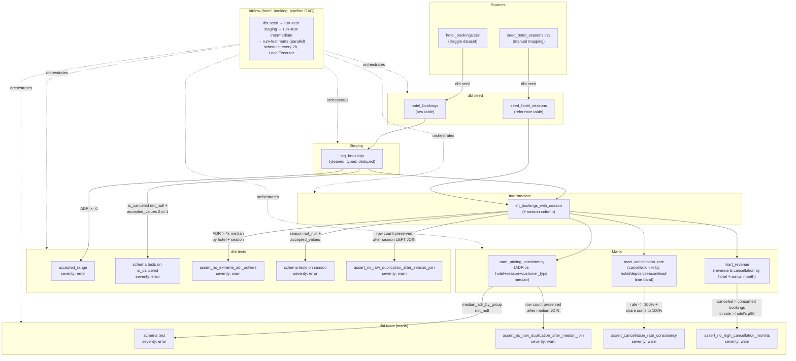
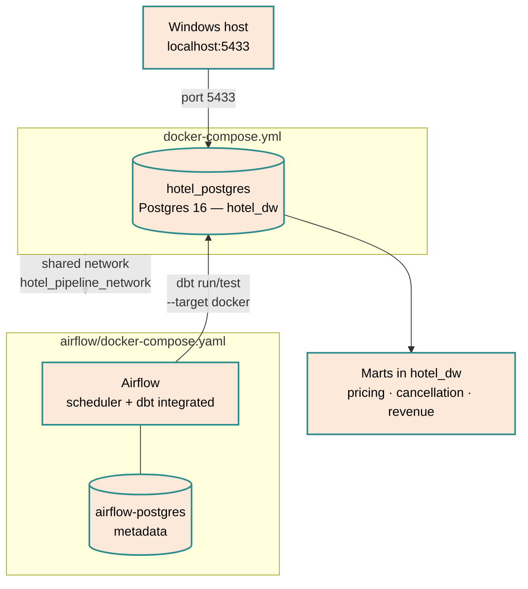

# Hotel Booking Pipeline

Postgres + dbt + Airflow (Docker) pipeline built on the [Hotel Booking Demand](https://www.kaggle.com/datasets/jessemostipak/hotel-booking-demand) dataset.

Builds on the dataset and cleaning logic explored in [Hotel_Booking_Analysis](https://github.com/JBaptisteAll/Hotel_Booking_Analysis), to build a productionized pipeline, orchestrated with Docker and Airflow.

📄 See [docs/decisions.md](docs/decisions.md) for the full reasoning behind these architecture and testing decisions.

## Infrastructure architecture

Two separate Docker Compose stacks, connected by a named external network
(`hotel_pipeline_network`) created by the root compose file and joined by
the Airflow one. `hotel_postgres` (data) and `airflow-postgres` (Airflow
metadata) are kept deliberately separate — an earlier session hit a service
name collision when both were named `postgres` on the same network.
[Details →](docs/decisions.md#docker-stack-localexecutor-custom-image-shared-network)

## Stack
- Postgres (data warehouse)
- dbt (transformation, medallion architecture: seed → staging → intermediate → mart)
- Airflow (orchestration, LocalExecutor, custom dbt-enabled image, Dockerized)

## Architecture decisions

### Ingestion: direct load instead of a cloud landing zone
`hotel_bookings.csv` is loaded directly via `dbt seed`, without an
intermediate cloud storage layer. A simulated S3 landing zone (LocalStack)
is a possible v2 evolution to demonstrate a more realistic ingestion
pattern. [Details →](docs/decisions.md#ingestion-direct-load-instead-of-a-cloud-landing-zone)

### Data quality & seasonality tests
The source dataset has no native booking ID, so `stg_bookings` exposes a
technical `booking_id` (row number) alongside a non-unique surrogate hash
kept only for investigation. ADR outliers are guarded by an
`accepted_range` test (no negative prices) and a singular test flagging
ADR beyond 4x the median for its `hotel` + `season` group, using a
seasonality seed (`seed_hotel_seasons`) and the `int_bookings_with_season`
model. `is_canceled` is guarded by `not_null` + `accepted_values ([0, 1])`,
since downstream marts branch on it with `CASE WHEN` logic that would
silently miscount on an unexpected value. [Details →](docs/decisions.md#data-quality-notes)

### Marts
`mart_pricing_consistency` compares each booking's ADR to the median of its
`hotel` + `season` + `customer_type` group, surfacing pricing deviations for
revenue management review. `mart_cancellation_rate` aggregates cancellation
rate (share of bookings) and each group's share of bookings by `hotel` +
`deposit_type` + `season` + lead-time band (Last minute / Standard / Early /
Xtra early). `mart_revenue` aggregates booked vs. consumed vs. canceled
bookings, guests, nights and revenue by `hotel` + arrival month, plus a
*revenue-based* `cancellation_rate_percent` (missed ÷ potential revenue —
not directly comparable to `mart_cancellation_rate`'s booking-count-based
rate of the same name).
All three are guarded by warn-severity singular tests: row-count parity for
`mart_pricing_consistency`, result sanity (rate ≤ 100%, shares sum to 100%)
for `mart_cancellation_rate`, and an outlier check for `mart_revenue`
flagging hotel-months with more canceled than consumed bookings or a
cancellation rate above that hotel's 90th percentile.
[Details →](docs/decisions.md#marts)

### Orchestration
The `hotel_booking_pipeline` DAG (`airflow/dags/hotel_booking_pipeline.py`)
runs `dbt seed` → run+test `stg_bookings` → run+test
`int_bookings_with_season` → run+test each mart, each `run`/`test` step as
its own `BashOperator`. The three marts branch out in parallel from
`test_intermediate`, so a failure in one mart doesn't block the others.
Airflow runs as its own Dockerized stack
(`airflow/docker-compose.yaml`, LocalExecutor, a custom image extending
`apache/airflow:3.3.1` with `dbt-core`/`dbt-postgres` installed), sharing
the `hotel_pipeline_network` Docker network with the `hotel_postgres`
container so tasks connect via the `docker` profile target
(`profiles.yml`) instead of the host-mapped port used for local `dbt`
runs. Scheduled every 2 hours (`0 */2 * * *`); DAGs are paused at creation,
so a fresh deploy needs a manual unpause in the UI before it starts
running. [Details →](docs/decisions.md#orchestration-airflow)

## Note on secrets

Postgres credentials are intentionally hardcoded in `docker-compose.yml` / `profiles.yml`: local dev environment, database not exposed, no sensitive data involved. In a production context, these would be moved to environment variables or a secrets manager (e.g. Docker secrets, AWS Secrets Manager) rather than committed in plain text.

Airflow's `FERNET_KEY` and `AIRFLOW_UID` live in `airflow/.env`, which is gitignored (not hardcoded like the Postgres credentials above, since Airflow generates/expects this file per environment). `airflow/config/` and `airflow/logs/` are gitignored for the same reason: generated at container startup, not part of the source-controlled setup.
