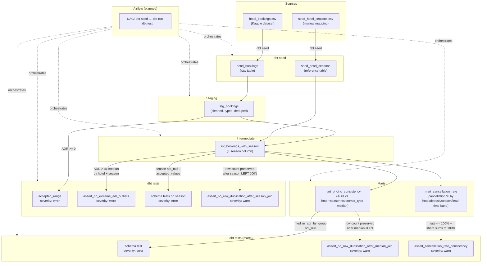

# Hotel Booking Pipeline

Postgres + dbt + Airflow (Docker) pipeline built on the [Hotel Booking Demand](https://www.kaggle.com/datasets/jessemostipak/hotel-booking-demand) dataset.

Builds on the dataset and cleaning logic explored in [Hotel_Booking_Analysis](https://github.com/JBaptisteAll/Hotel_Booking_Analysis), to build a productionized pipeline, orchestrated with Docker.

📄 See [docs/decisions.md](docs/decisions.md) for the full reasoning behind these architecture and testing decisions.

## Stack
- Postgres (data warehouse)
- dbt (transformation, medallion architecture: seed → staging → intermediate → mart)
- Airflow (orchestration)

## Architecture decisions

### Ingestion: direct load instead of a cloud landing zone
`hotel_bookings.csv` is loaded directly via `dbt seed`, without an
intermediate cloud storage layer. A simulated S3 landing zone (LocalStack)
is a possible v2 evolution to demonstrate a more realistic ingestion
pattern. [Details →](docs/decisions.md#ingestion-direct-load-instead-of-a-cloud-landing-zone)

### Data quality & seasonality tests
The source dataset has no native booking ID, so `stg_bookings` exposes a
technical `booking_id` (row number) alongside a non-unique surrogate hash
kept only for investigation. ADR outliers are guarded by an
`accepted_range` test (no negative prices) and a singular test flagging
ADR beyond 4x the median for its `hotel` + `season` group, using a
seasonality seed (`seed_hotel_seasons`) and the `int_bookings_with_season`
model. [Details →](docs/decisions.md#data-quality-notes)

### Marts
`mart_pricing_consistency` compares each booking's ADR to the median of its
`hotel` + `season` + `customer_type` group, surfacing pricing deviations for
revenue management review. `mart_cancellation_rate` aggregates cancellation
rate and each group's share of bookings by `hotel` + `deposit_type` +
`season` + lead-time band (Last minute / Standard / Early / Xtra early).
Both are guarded by warn-severity singular tests checking row-count parity
and result sanity (rate ≤ 100%, shares sum to 100%).
[Details →](docs/decisions.md#marts)

## Note on secrets

Postgres credentials are intentionally hardcoded in `docker-compose.yml` / `profiles.yml`: local dev environment, database not exposed, no sensitive data involved. In a production context, these would be moved to environment variables or a secrets manager (e.g. Docker secrets, AWS Secrets Manager) rather than committed in plain text.
